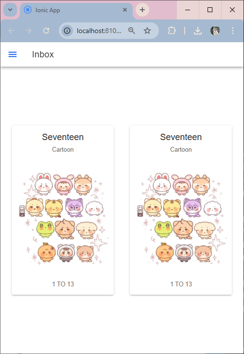

# Praktikum Mobile Pertemuan 7

Nama : Muthia Khanza
NIM : H1D022008
Shift Baru : C
Shift Lama : A

# Penjelasan

Untuk menambahkan komponen di halaman Ionic yaitu yang menambahkan tag ion card yang didalam nya berisis card title yang digunakan untuk memberikan judul pada card, lalu ada card subtitle yang berisikan judul kedua yang letaknya di bawah judul dari card, selanjutnya untuk menambahkan image, dapat menggunakan tag ion-image dengan src yang berisikan alamat penyimpanan image, dan yang terakhir ada ion card-content berisikan deskripsi konten yang ingin di berikan pada card. Lalu sesuaikan tampilan menggnuakan style css.
